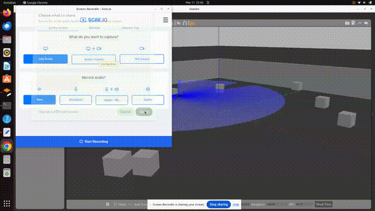
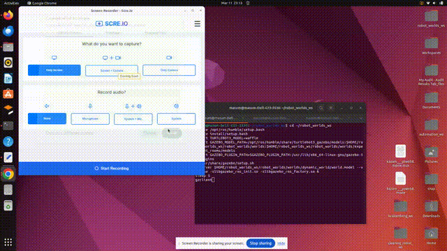
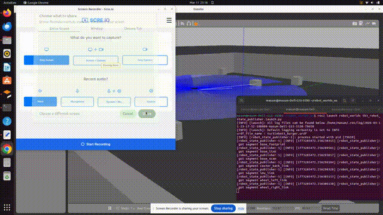
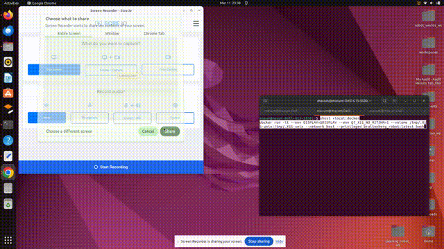
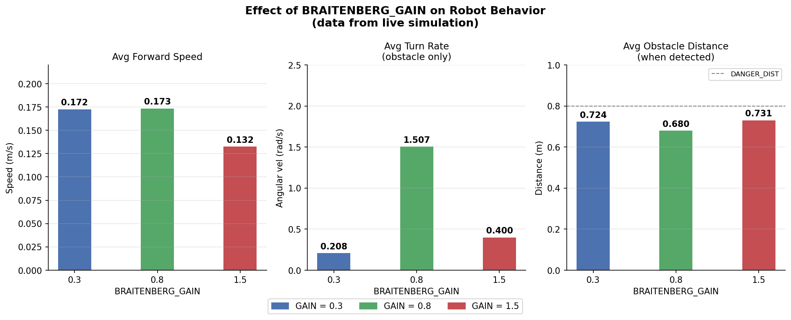

# Braitenberg Autonomous Robot — ENPM690 HW3

Autonomous TurtleBot3 navigation using Braitenberg vehicle behavior for dynamic obstacle avoidance in ROS2 Humble + Gazebo 11.

---

## Demo

### Part 1 — Teleoperation


### Part 2 — Autonomous Navigation (GAIN=0.3)


### Autonomous Navigation (GAIN=0.8)


### Autonomous Navigation (GAIN=1.5) + Docker


### GAIN Parameter Analysis


---

## Overview

The robot uses a **Braitenberg Fear Vehicle** algorithm — a bio-inspired reactive approach where LIDAR sensor readings directly inhibit motor outputs. When an obstacle is detected on the right, the left motor slows down, steering the robot away. No map or path planning required.

The robot visits all 4 corners of a 10x10m room while avoiding 9 dynamic moving obstacles.

---

## Package Structure
```
braitenberg_ws/
├── src/autonomous_robot/
│   ├── autonomous_robot/
│   │   ├── obstacle_avoidance_node.py   # Braitenberg autonomous node
│   │   └── teleop_node.py               # Keyboard teleoperation node
│   ├── package.xml
│   └── setup.py
├── docker/
│   ├── Dockerfile
│   ├── launch_demo.sh
│   └── worlds/                          # dynamic obstacle world
├── media/                               # demo GIFs
└── gain_analysis.py                     # GAIN parameter analysis
```

---

## Quick Start — Docker (Recommended)
```bash
# Build
cd ~/braitenberg_ws
docker build -f docker/Dockerfile -t braitenberg_robot:latest .

# Run
xhost +local:docker
docker run -it --env DISPLAY=$DISPLAY --env QT_X11_NO_MITSHM=1 \
  --volume /tmp/.X11-unix:/tmp/.X11-unix \
  --network host --privileged \
  braitenberg_robot:latest bash

# Inside container
bash /launch_demo.sh
```

---

## Quick Start — Local
```bash
# Terminal 1 — Gazebo
cd ~/robot_worlds_ws
source /opt/ros/humble/setup.bash
source install/setup.bash
export TURTLEBOT3_MODEL=waffle
export GAZEBO_MODEL_PATH=/opt/ros/humble/share/turtlebot3_gazebo/models:$HOME/robot_worlds_ws/robot_worlds/worlds:$HOME/robot_worlds_ws/robot_worlds/worlds/experiment_rooms/models
export GAZEBO_PLUGIN_PATH=$GAZEBO_PLUGIN_PATH:/usr/lib/x86_64-linux-gnu/gazebo-11/plugins
. /usr/share/gazebo/setup.sh
gzserver $HOME/robot_worlds_ws/robot_worlds/worlds/dynamic_world/world.model --verbose -slibgazebo_ros_init.so -slibgazebo_ros_factory.so &
sleep 5
gzclient

# Terminal 2 — State publisher
cd ~/robot_worlds_ws
source /opt/ros/humble/setup.bash
source install/setup.bash
ros2 launch robot_worlds tb3_robot_state_publisher.launch.py

# Terminal 3 — Autonomous node
cd ~/braitenberg_ws
source /opt/ros/humble/setup.bash
source install/setup.bash
ros2 run autonomous_robot obstacle_avoidance
```

---

## Tunable Parameter

`BRAITENBERG_GAIN` in `obstacle_avoidance_node.py` controls obstacle avoidance sensitivity:

| GAIN | Behavior | Avg Speed |
|------|----------|-----------|
| 0.3 | Bold — gets close to obstacles, moves faster | ~0.17 m/s |
| 0.8 | Balanced — recommended setting | ~0.13 m/s |
| 1.5 | Cautious — reacts early, moves slower | ~0.07 m/s |

---

## Dependencies

- Ubuntu 22.04
- ROS2 Humble
- Gazebo 11
- TurtleBot3 Simulations
- Python 3: opencv-python, numpy
- Docker (optional)

---

## License

MIT
